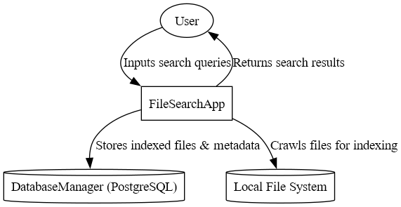

# ARCHITECTURE.md

## Search Engine: Iteration 1 - Software Design 2025

## 1. Context Diagram

### Purpose
The Context Diagram provides a high-level view of the "Search Engine" system, showing its boundaries and interactions with external entities. It establishes the scope of Iteration 1: indexing and searching textual files locally.

### Diagram

### Description
The "Search Engine" is depicted as a single system interacting with two external entities:
- **User**: The individual who uses the search engine by entering queries to find files.
- **Local File System**: The source of text files on the user's device, which the system crawls and indexes.

---

## 2. Container Diagram

### Purpose
The Container Diagram zooms into the "Search Engine" system, breaking it into major deployable units (containers) and showing how they collaborate to achieve the functionality of crawling, indexing, and searching text files.

### Diagram

### Description
The system is composed of four containers, interacting with the external entities (User and Local File System):
- **File Crawler**: Recursively traverses the local file system to identify and collect textual files 
- **Indexer**: Processes files by extracting text content (first 3 lines for previews) and metadata (filename, timestamp), then stores the data in the database.
- **Database**: A SQLite database that stores indexed data (filenames, content previews, metadata) and supports full-text search queries.
- **Search Interface**: Accepts user queries, retrieves matching results from the database, and displays them with previews.

## 3. Component Diagram (Indexer)

### Purpose
The Component Diagram provides a detailed view of the "Indexer" container, showing its internal components and how they process files for storage in the database. The Indexer is chosen because it’s central to transforming raw files into searchable data.

### Diagram

### Description
The "Indexer" container consists of three components:
- **Text Extractor**: Reads textual files and extracts the first 3 lines as a content preview.
- **Metadata Extractor**: Collects file metadata, such as filename, extension, and modification timestamp.
- **Database Writer**: Inserts the extracted text and metadata into the SQLite database for storage and querying.

